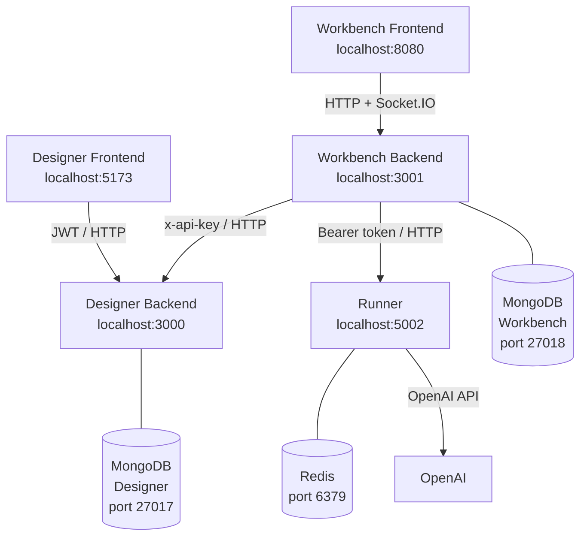

# Contributing to LEIA

Thank you for your interest in contributing to LEIA. Before diving into any individual repository, read this page. It explains how the system is structured, how services talk to each other, and how to run the full stack locally.

---

## System Architecture

:::important
Right now LEIA only supports OpenAI as a provider, but in the future it will support more providers and even custom ones, so users can connect to the desired one.
:::

LEIA is made up of **5 application services** supported by **2 databases and 1 cache**:



---

## Services at a Glance

| Service | Role | Default Port | Auth method exposed | Database |
| --- | --- | --- | --- | --- |
| Designer Backend | REST API for LEIAs, personas, problems, experiments | `3000` | JWT + `x-api-key` | MongoDB (manager) |
| Designer Frontend | Web UI for instructors to build LEIAs | `5173` | - | - |
| Workbench Backend | REST API + Socket.IO for experiment sessions | `3001` | Admin secret, JWT, share token | MongoDB (workbench) |
| Workbench Frontend | Web UI for participants and instructors | `8080` | - | - |
| Runner | AI session execution engine (LLM proxy) | `5002` | Bearer token | Redis |

---

## Inter-Service Communication

Services authenticate with each other using shared pre-shared keys:

| Caller | Callee | Header | Key variable |
| --- | --- | --- | --- |
| Designer Frontend | Designer Backend | `Authorization: Bearer <jwt>` | User JWT (issued on login) |
| Workbench Frontend | Workbench Backend | `Authorization: Bearer <jwt>` / Socket.IO auth | User JWT / Admin secret / share token |
| Workbench Backend | Designer Backend | `x-api-key: <key>` | `MANAGER_KEY` → `API_KEY` |
| Workbench Backend | Runner | `Authorization: Bearer <key>` | `RUNNER_KEY` (both sides) |

:::info
`RUNNER_KEY` must be set to the **same value** in both the Workbench Backend and the Runner. `MANAGER_KEY` in the Workbench Backend must match `API_KEY` in the Designer Backend.
:::

---

## Running the Full Stack Locally

### 1. Start infrastructure (MongoDB × 2 + Redis)

```bash
# MongoDB for Designer Backend (port 27017)
docker run -d --name mongo-designer -p 27017:27017 mongo:latest

# MongoDB for Workbench Backend (port 27018)
docker run -d --name mongo-workbench -p 27018:27017 mongo:latest

# Redis for Runner (port 6379)
docker run -d --name redis -p 6379:6379 redis:latest
```

### 2. Configure and start the backends

```bash
# Designer Backend
cd leia-designer-backend
cp .env.example .env          # set JWT_SECRET, API_KEY, RUNNER_URL, RUNNER_KEY
npm install && npm run dev    # http://localhost:3000

# Workbench Backend (new terminal)
cd leia-workbench-backend
cp .env.example .env          # set MANAGER_URL=http://localhost:3000, MANAGER_KEY, RUNNER_KEY, OPENAI_API_KEY
npm install && npm run dev    # http://localhost:3001

# Runner (new terminal)
cd leia-runner
cp .env.example .env          # set OPENAI_API_KEY, RUNNER_KEY (same as Workbench)
npm install && npm run dev    # http://localhost:5002
```

### 3. Start the frontends

```bash
# Designer Frontend (new terminal)
cd leia-designer-frontend
cp .env.example .env          # VITE_APP_BACKEND=http://localhost:3000
npm install && npm run dev    # http://localhost:5173

# Workbench Frontend (new terminal)
cd leia-workbench-frontend
cp .env.example .env          # VITE_APP_BACKEND=http://localhost:3001
npm install && npm run dev    # http://localhost:8080
```

### Startup order

Start services in this order to avoid connection errors on boot:

```text
MongoDB (×2) → Redis → Designer Backend → Workbench Backend → Runner → Frontends
```

---

## Repository Index

| Repository | Page |
| --- | --- |
| [leia-org/leia-infrastructure-docker](https://github.com/leia-org/leia-infrastructure-docker) | [Infrastructure Docker](./infrastructure-docker) |
| [leia-org/leia-designer-frontend](https://github.com/leia-org/leia-designer-frontend) | [Designer Frontend](./designer-frontend) |
| [leia-org/leia-designer-backend](https://github.com/leia-org/leia-designer-backend) | [Designer Backend](./designer-backend) |
| [leia-org/leia-runner](https://github.com/leia-org/leia-runner) | [Runner](./runner) |
| [leia-org/leia-workbench-frontend](https://github.com/leia-org/leia-workbench-frontend) | [Workbench Frontend](./workbench-frontend) |
| [leia-org/leia-workbench-backend](https://github.com/leia-org/leia-workbench-backend) | [Workbench Backend](./workbench-backend) |
| [leia-org/web](https://github.com/leia-org/web) | [Web (Docs)](./web) |

---

## General Guidelines

1. **Fork** the relevant repository and clone your fork.
2. Create a **feature branch**: `feat/my-change` or `fix/my-bug`.
3. Follow the repo-specific setup instructions in the pages above.
4. Use **Conventional Commits** for commit messages (`feat:`, `fix:`, `docs:`, etc.).
5. All contributions must pass existing tests before being reviewed.
6. Prefer small, focused PRs over large all-in-one diffs.
7. Found a bug or have an idea? Open a **GitHub Issue** in the appropriate repository.
