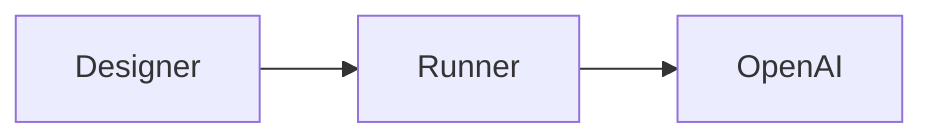

# Web (Documentation)

**Repository:** [leia-org/web](https://github.com/leia-org/web)

The official LEIA documentation website. This contains the site you are reading right now. Built with **Docusaurus 3**, **React 19**, and **TailwindCSS**. Deployed to GitHub Pages at [leia.ovh](https://leia.ovh).

---

## Tech Stack

| Technology | Purpose |
| --- | --- |
| Docusaurus 3 | Static site generator and documentation framework |
| React 19 + TypeScript | UI components and custom pages |
| TailwindCSS 3 | Utility-first styling |
| @tailwindcss/typography | Prose styles for Markdown content |
| Framer Motion | Animations on the landing page |
| Mermaid.js | Diagram rendering inside docs |
| Prism | Code syntax highlighting |
| Lucide React | Icon library |
| MDX | Markdown with embedded React components |
| GitHub Pages | Hosting and deployment |

---

## Prerequisites

- **Node.js** >= 18.x
- **npm**

No environment variables are required for local development.

---

## Project Structure

```text
web/
├── docs/                        # All documentation content (Markdown / MDX)
│   ├── img/                     # Images organised by category
│   ├── introduction/            # Getting started docs
│   ├── tutorials/               # Step-by-step guides
│   └── contributing/            # This section
├── src/                         # React source code
│   ├── components/              # Landing page components (Hero, Features, About…)
│   ├── css/
│   │   └── custom.css           # Global styles (Tailwind imports + custom utilities)
│   ├── lib/
│   │   └── utils.ts             # Shared utility functions
│   ├── pages/
│   │   └── index.js             # Landing page entry point
│   └── theme/                   # Swizzled Docusaurus components
│       ├── Footer/              # Custom footer
│       ├── Navbar/              # Custom navbar
│       └── NavbarItem/          # Custom navbar items
├── static/                      # Static assets (logo, favicon, social card)
├── docusaurus.config.js         # Main Docusaurus configuration
├── sidebars.js                  # Sidebar structure definition
├── tailwind.config.js           # TailwindCSS configuration
└── package.json                 # Dependencies and npm scripts
```

---

## Local Development

1. Fork and clone the repository:

   ```bash
   git clone <your-fork-url>
   cd web
   ```

2. Install dependencies:

   ```bash
   npm install
   ```

3. Start the development server:

   ```bash
   npm start
   ```

The site will be available at `http://localhost:3000` with hot-reload enabled.

---

## Available Scripts

| Script | Command | Description |
| --- | --- | --- |
| Dev server | `npm start` | Start local dev server with hot-reload |
| Build | `npm run build` | Build the production-ready static site |
| Serve | `npm run serve` | Serve the built site locally for testing |
| Deploy | `npm run deploy` | Build and push to the `gh-pages` branch |
| Clear cache | `npm run clear` | Delete the Docusaurus build cache |
| Write translations | `npm run write-translations` | Generate i18n translation files |
| Write heading IDs | `npm run write-heading-ids` | Auto-generate anchor IDs for headings |

---

## Adding or Updating Documentation

### New Pages

1. Create a `.md` or `.mdx` file inside the appropriate `docs/` category folder.
2. Add frontmatter at the top of the file:

   ```md
   ---
   sidebar_position: 2
   ---
   ```

3. Images go in `docs/img/<category>/` and are referenced with relative paths:

   ```md
   
   ```

### Diagrams

Mermaid diagrams are supported out of the box. Use a fenced code block with the `mermaid` language tag:

````md

````

### Versioning

To snapshot the current docs as a new version:

```bash
npm run docusaurus docs:version <version>
```

This creates a `versioned_docs/version-<version>/` folder and adds the version to the version selector in the navbar.

### Styling

- Global styles live in `src/css/custom.css`.
- Use predefined Tailwind classes and custom utilities such as `.glass-card` and `.glass-panel`.
- Follow the LEIA brand: **Vibrant Violet** primary (`#7c3aed`), dark slate backgrounds.
- Do not add inline styles. Use Tailwind classes or extend `custom.css`.

---

## Contributing

1. Fork the repository and create a branch off `main`:

   ```bash
   git checkout -b docs/my-change
   ```

2. Follow the project structure above when adding new documentation pages or sections.

3. Run the dev server and verify your changes locally before opening a PR:

   ```bash
   npm start
   ```

4. Make sure the site **builds without errors**:

   ```bash
   npm run build
   ```

5. Use **Conventional Commits** for your commit messages (`docs:`, `feat:`, `fix:`, etc.).

6. Open a Pull Request. **Include screenshots** for any visual or layout changes.
